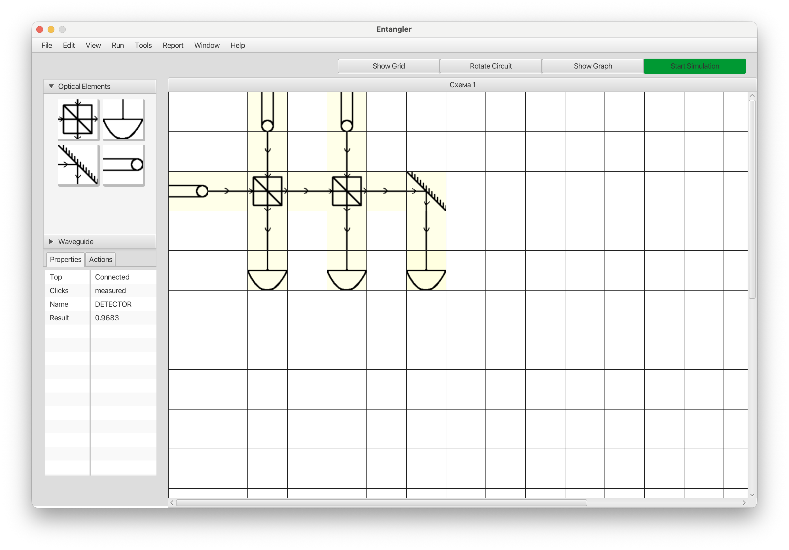

# Entangler - Quantum Optical Circuit Simulator

**Resurrected master's project [handled](https://github.com/dbudyak/archive/compare/cd207ea...da37fcc) and fixed by Claude**

A JavaFX application for designing and simulating optical quantum networks. Build circuits using sources, beam splitters, waveguides, mirrors, and detectors to explore quantum interference and photon behavior.



## Features

- Drag-and-drop circuit design on a grid
- Quantum elements: sources, beam splitters (BS), waveguides, mirrors, detectors
- Real-time probability calculation with quantum interference
- Element rotation and directional light flow
- Support for complex multi-element circuits

## Running

```bash
./gradlew run
```

## Building

```bash
./gradlew build
```

---

*Originally created 2014. Modernized and debugged in 2025 with modern build tools and fixed quantum computation logic.*
